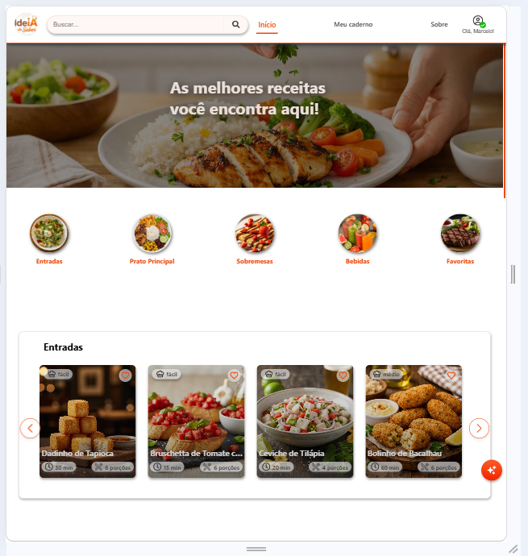
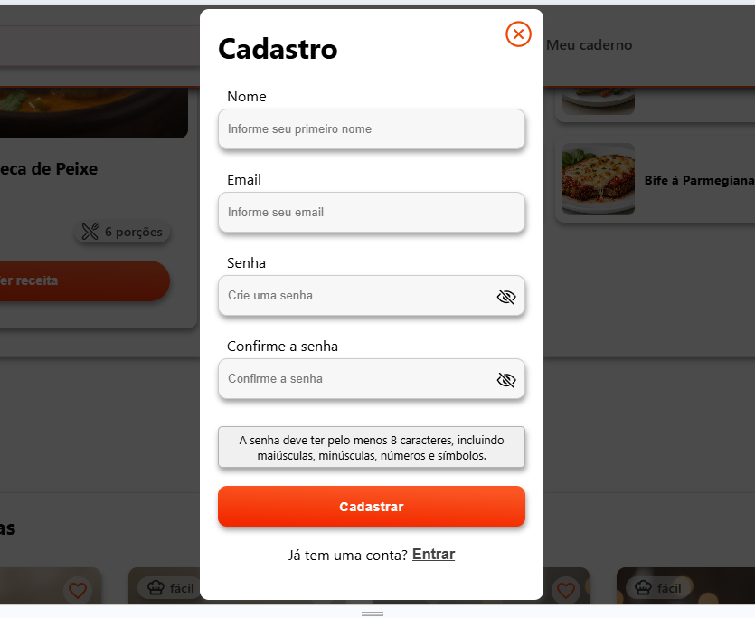
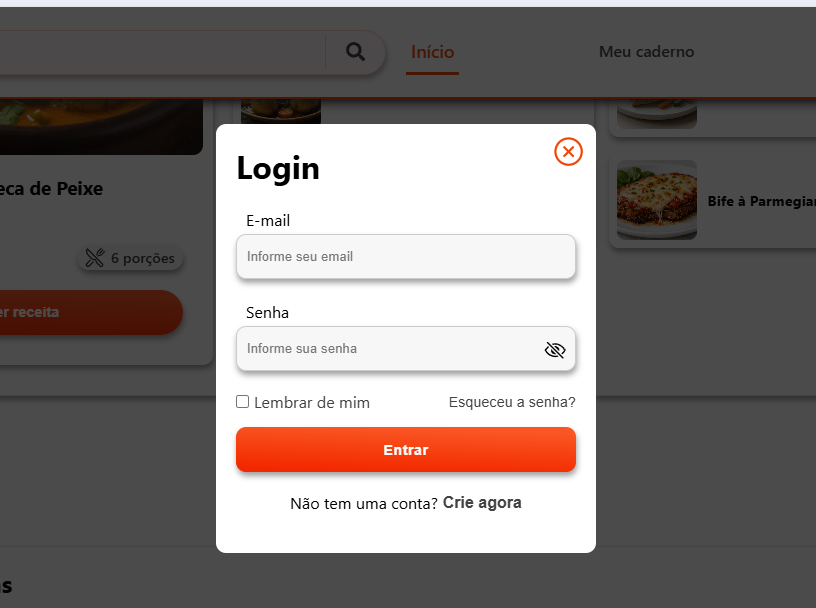

# 👨‍🍳 IdeiA de Sabor - Front-end

Bem-vindo ao repositório do **IdeiA de Sabor**! 🚀 Este projeto nasceu como um grande desafio de estudos e tornou-se o ambiente onde mais evoluí como desenvolvedor Front-end. Cada tela e funcionalidade foi construída com foco em entregar uma experiência de utilizador profissional, fluida e segura.

🌟 **Acesse o projeto ao vivo:** [ideias-de-sabor.netlify.app](https://ideias-de-sabor.netlify.app)

---

## 🔐 Foco em Autenticação e Segurança

Um dos grandes marcos deste aprendizado foi a implementação de um **Sistema Completo de Cadastro e Login de Utilizadores**. 

* Desenvolvi validações de formulário em tempo real (Regex) para garantir a integridade dos dados.
* Implementei um fluxo seguro de recuperação de conta via e-mail com tokens de segurança.
* A interface responde de forma inteligente ao status de autenticação, protegendo rotas e dados.

Toda esta lógica de utilizador é alimentada por uma API robusta, disponível no meu [Repositório Back-end (Node.js)](https://github.com/marceloguima/servidor-app-receitas), onde explorei a integração profunda entre o servidor e o banco de dados.

## 🤖 O "Chefinho"

A "cereja no topo do bolo" de todo este aprendizado é o **'Chefinho'**: um assistente virtual que implementei para gerar receitas de forma inteligente. Este recurso uniu o desafio de criar uma interface amigável com a complexidade de gerir respostas dinâmicas.

---

## 📸 Algumas Telas

Aqui estão algumas imagens das principais telas do aplicativo, mostrando a identidade visual final.

### 1. Início
A tela principal onde o usuário visualiza suas receitas e busca inspiração culinária.


### 2. Cadastro de Usuário
Mostra a validação em tempo real e a barra de segurança da senha (componente `<CamposDeSenha />`).


### 3. Login (Split Screen)
O design moderno de "tela dividida", equilibrando uma imagem apetitosa com a funcionalidade de acesso.


---

## 🛠️ Tecnologias Utilizadas

* **React.js (Vite):** Framework para construção da interface.
* **React Router Dom:** Gerenciamento de rotas e parâmetros dinâmicos.
* **Axios:** Cliente HTTP para comunicação com a API.
* **CSS3:** Estilização personalizada com foco em UX.

---

## ⚙️ Como Rodar Localmente

⚠️ **Aviso Importante:** Como este é um projeto Full-Stack, a interface precisa que a API esteja rodando na sua máquina para que o Cadastro, Login e o "Chefinho" funcionem. Certifique-se de também clonar e iniciar o [Repositório Back-end (Node.js)](https://github.com/marceloguima/servidor-app-receitas).

**1. Clone o repositório:**

**2. Instale as dependências:**
```bash
npm install
```

**3. Configure as variáveis de ambiente:** Crie um arquivo `.env` na raiz do projeto e adicione a seguinte linha apontando para a sua API local:
```env
VITE_API_URL=http://localhost:3001/api
```

**4. Inicie o projeto:**
```bash
npm run dev
```
